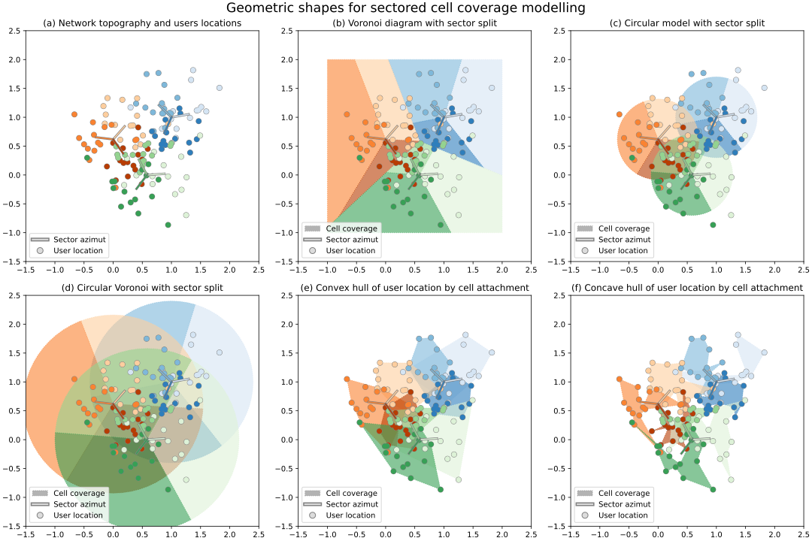

GeoLibCov: Geographic Library for Cell Coverage Modelling and Topography Generation 
========================================================================

__GeoLibCov__ is a library for modelling the coverage of radio cells with simple geometries. It provides the following features:

* computation of cells limit radius based on budget link calculations.
* Voronoi and Circular coverage modelling and evaluation
* for illustrative purposes, random generation of radio cell topographies (positions, frequency, sectors, height) and user equipment attachment. 



## Quick start

### Install

Clone the project from GitLab:

```
$ git clone https://github.com/qiuda22/GeoLibCov.git
```

In the project directory, install the package in development mode:

```
pip install -e .
```

###  Examples of usage

To generate and plot the topography:

```python
from datacov import TopoGen
from datacov import VoroGeom, CircleGeom, EmpiricalGeom

import geopandas as gpd

band_params = {
    'bands': [700, 800, 1800, 2100, 2600],
    'band_probs': [0.5, 1., 0.8, 0.6, 0.5],
    'ue_dist_scale': [0.08, 0.05, 0.04, 0.03, 0.025],
    'ue_dist_loc': [0.2, 0.1, 0.08, 0.06, 0.05]
}
topo = TopoGen(**band_params)
topo.generate_topo()

topo.plot_topography()
```

See the [notebooks](notebooks/) directory for various examples.

## References

* The project depends on [shapely](https://github.com/shapely/shapely) and [geopandas](https://github.com/geopandas/geopandas) for handling geometric operations.
* Limit radius expressions adapted from the [3GPP Technical Report 38.901 (v. h00)](https://www.3gpp.org/ftp/Specs/archive/38_series/38.901/?sortby=daterev), and from the [3GPP Technical Report 43.030 (v. h00)](https://www.3gpp.org/ftp/Specs/archive/43_series/43.030/?sortby=daterev)
* Budget link calculation based on the lecture [Bilans de liaison : de la 2G à la 5G](https://marceaucoupechoux.wp.imt.fr/files/2021/05/RIO207-BdL-2G-4G-5G.pdf), by Marceau Coupechoux.

## License

Copyright (c) 2023 Orange

This code is released under the BSD 3-Clause "New" or "Revised" License. See the `LICENSE.txt` file for more information.

## Contact

* [dannyfrance@gmail.com](mailto:dannyfrance@gmail.com)
* [alassane.samba@orange.com](mailto:alassane.samba@@orange.com)
